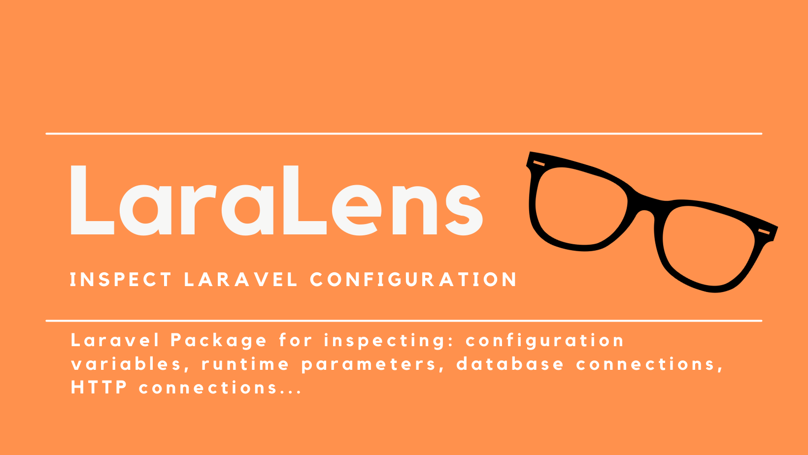

# LaraLens




## What
**LaraLens** is a _Laravel_ artisan command to show you the current configuration of your
application. It is useful to show in your terminal the status of:
* some useful configuration variable;
* the database connection;
* the tables in the database;
* the connection via HTTP request.

## Why
When I have a new Laravel Application deployed on the target server, usually I perform a list of commands in order to check the configuration, the connection to database, inspect some tables, the response of the web server.
I tried to show more information in just one command.
This is useful also when the installation of your Laravel application is on premises, and someone else takes care about the configuration. So, in this scenario usually, as developer, your first question is: "how is configured the application?".

## Installation

You can install the package via composer:

```bash
composer require hi-folks/lara-lens
```

The Packagist page is:
https://packagist.org/packages/hi-folks/lara-lens

## Usage

```bash
php artisan laralens:diagnostic
```

### Usage: control database connection
You can see Database Connection information, and you can choose the table to check, and the column used for the "order by" (default created_at):
```sh
php artisan laralens:diagnostic --table=migrations --column-sort=id
```
To take the last **created** user:
```
php artisan laralens:diagnostic --table=users --column-sort=created_at
```
To take the last **updated** user:
```
php artisan laralens:diagnostic --table=users --column-sort=updated_at
```

### Usage: control the output
You can control the output via the _show_ option. You can define:

* config
* connection
* database
* runtime
* migration
* all
The defalut for _--show_ option is _all_.


```sh
php artisan laralens:diagnostic --show=config --show=connection --show=database --show=runtime --show=migration
```

If you want to see only database information:

```sh
php artisan laralens:diagnostic --show=database
```
### Usage: change the style of output table
You can choose one of these styles via *--style=* option:

* default
* borderless
* compact
* symfony-style-guide
* box
* box-double

For example:
```sh
php artisan laralens:diagnostic --style=borderless
```


### Testing

``` bash
composer test
```

### Changelog

Please see [CHANGELOG](CHANGELOG.md) for more information what has changed recently.

## Contributing

Please see [CONTRIBUTING](CONTRIBUTING.md) for details.

### Submit ideas or feature requests or issues

* Take a look if your request is already there [https://github.com/Hi-Folks/lara-lens/issues](https://github.com/Hi-Folks/lara-lens/issues)
* If it is not present, you can create a new one [https://github.com/Hi-Folks/lara-lens/issues/new](https://github.com/Hi-Folks/lara-lens/issues/new)


## Credits

- [Roberto Butti](https://github.com/hi-folks)
- [All Contributors](../../contributors)
- [Laravel Package Boilerplate](https://laravelpackageboilerplate.com)

## License

The MIT License (MIT). Please see [License File](LICENSE.md) for more information.
